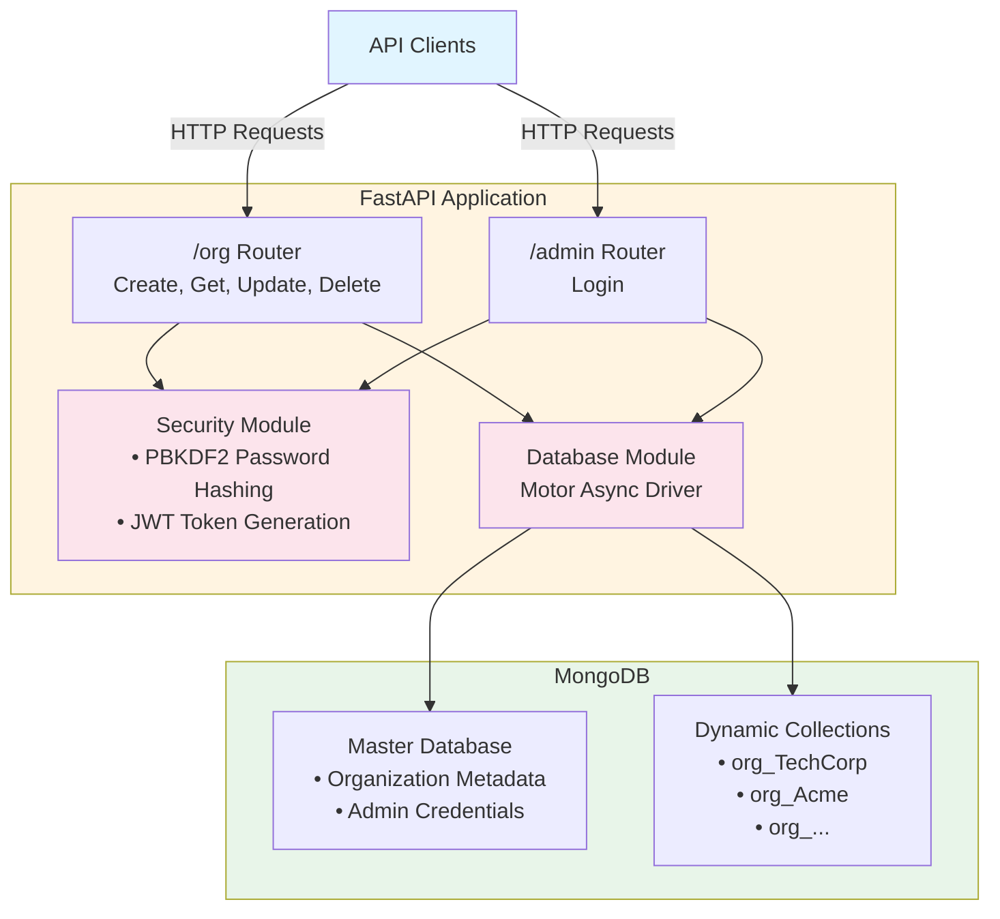

# Architecture Diagram

## Component Descriptions

### Client Layer
- External applications and API consumers making HTTP requests

### API Layer
- **Organization Router**: CRUD operations for organizations
- **Admin Router**: Authentication endpoint returning JWT tokens

### Business Logic Layer
- **Security Module**: Handles password hashing (PBKDF2-SHA256) and JWT generation
- **Database Module**: Async MongoDB operations using Motor driver

### Data Layer
- **Master Database**: Stores organization metadata and admin credentials
- **Dynamic Collections**: One collection per organization for complete data isolation
